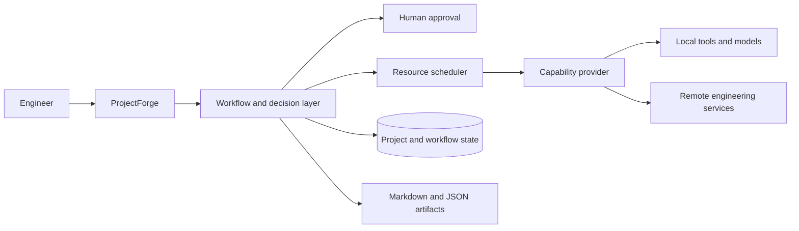

# ProjectForge

ProjectForge is an open-source orchestration platform for AI-assisted software
engineering. It coordinates workflows, decisions, approvals, execution
providers, project state, and engineering artifacts while delegating specialist
work to established tools.

> ProjectForge owns orchestration. Providers own execution.

## Status

ProjectForge has a working technical spike that creates approval-gated
workflows, persists them in SQLite, survives process restart, selects a
deterministic local provider, executes approved work once, and publishes
auditable Markdown and JSON artifacts.

The spike remains a development milestone rather than a production release.
A bounded direct Ollama adapter is available for integration testing, while
managed runtime/model provisioning, authentication, and the operator dashboard
remain on the roadmap.

See the [roadmap](docs/ROADMAP.md) for current progress and upcoming milestones.

## Architecture



Workflows request an engineering capability and its constraints rather than a
specific product. ProjectForge then selects an eligible provider according to
policy, health, locality, cost, and operational requirements.

Read the [architecture overview](docs/architecture/overview.md) for boundaries,
design principles, and the planned vertical slice.

## Repository

- `ProjectForge.Abstractions` contains stable contracts and domain models.
- `ProjectForge.Core` contains provider registration and orchestration policy.
- `ProjectForge.Application` contains approval-gated workflow coordination.
- `ProjectForge.Infrastructure` contains SQLite-backed durable state, artifact
  writing, and concrete execution providers.
- `ProjectForge.Host` exposes the executable workflow HTTP API.
- `ProjectForge.Core.Tests` and `ProjectForge.Application.Tests` contain
  behavior-focused automated verification.
- `docs` contains the roadmap, architecture, and decision records.

Infrastructure and concrete provider projects will be introduced only when
required by a validated milestone.

## Prerequisites

- [.NET SDK 8.0.423](https://dotnet.microsoft.com/download/dotnet/8.0)

The required SDK is pinned by `global.json`.

## Build

```shell
dotnet restore
dotnet build --no-restore
```

Run the automated tests with:

```shell
dotnet test --no-restore
```

Follow the
[technical-spike manual demonstration](docs/MANUAL_DEMO.md)
to reproduce the pause, restart, approval, execution, artifact, and audit
lifecycle.

## Ollama integration boundary

The first M3 slice can connect to an already-running Ollama service on an HTTP
loopback address. It refuses to become ready unless the configured runtime
version, exact model name, SHA-256 digest, and completion capability all match.
`GET /providers` exposes the resulting readiness without returning provider
configuration or arbitrary metadata.

Select Ollama through external configuration:

```powershell
$env:ProjectForge__Providers__Mode = "Ollama"
$env:ProjectForge__Providers__Ollama__Endpoint = "http://127.0.0.1:11434"
$env:ProjectForge__Providers__Ollama__Model = "<exact-installed-model>"
$env:ProjectForge__Providers__Ollama__ExpectedDigest = "<64-hex-digest>"
$env:ProjectForge__Providers__Ollama__MinimumRuntimeVersion = "<minimum>"
$env:ProjectForge__Providers__Ollama__MaximumRuntimeVersionExclusive = "<maximum>"
```

This is a development integration boundary, not the finished zero-friction
experience. ProjectForge does not yet download Ollama or models because doing
so safely requires a reviewed artifact/model manifest, published integrity
evidence, model-license consent, restart recovery, and managed lifecycle
cancellation. See the separate
[Ollama](docs/evaluations/OLLAMA.md) and
[LiteLLM](docs/evaluations/LITELLM.md) evaluations.

## Development approach

ProjectForge uses milestone-based delivery:

1. Define acceptance criteria and update the relevant documentation.
2. Implement the smallest end-to-end behavior that proves the milestone.
3. Add automated verification and record meaningful architecture decisions.
4. Update the roadmap and changelog in the same commit.
5. Check in only after the milestone is buildable and its evidence is recorded.

See [CONTRIBUTING.md](CONTRIBUTING.md) for the working agreement.

## License

A project license has not yet been selected. Until one is added, the repository
is publicly visible but no open-source license is granted.
